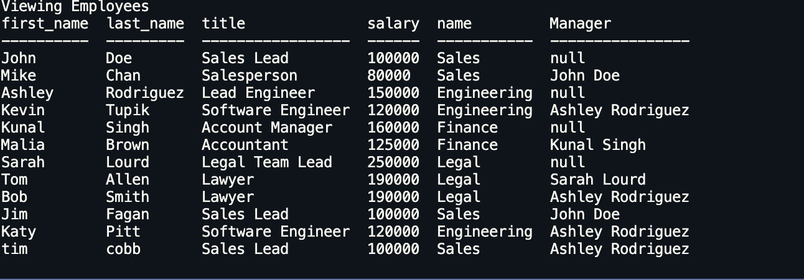

# 12-Employee-Tracker
by: Jack Funck


## table of Contents:

 - [ Description. ](#desc)
 - [ Instructions. ](#instr)
 - [Technologies.](#tc)
 - [Dependencies](#dep)
 - [ Video. ](#video)
 - [Screen-Shots.](#sc)


<a name="desc"></a>
## Description

A solution for managing a company's employees using node, inquirer, and MySQL


<a name="instr"></a>
## Instructions
Run this command in your Command line
```
node scripte.js
```
* Move through the Selections and choose from (View all employees, View all employees by role, view all employees by department, Add employee, add role, add department, Update employee role(IM still working on this), (I am also currently working on the other selections)).
* Click the option you want and follow the prompts.

<a name="tc"></a>
## Technologies Used
* Node.js
* JavaScript
* bootstrap
* Mysql

<a name="dep"></a>
# Dependencies
* inquirer


<a name="video"></a>
# Video of how it works.
> If you click GIF you will be navigated to YouTube for a full-video.

[](https://youtu.be/1TNOc0puJC4)


<a name="sc"></a>
# Screen Shots
### Sample shots



